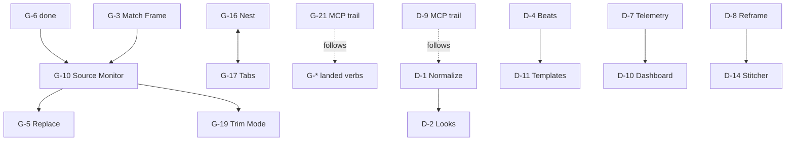

# Video Editor Roadmap

**Status:** Live authoritative backlog  
**Date:** 2026-07-10

## 1. Authority and precedence

This file owns live video backlog status, priority, gates, and delivery order. Detailed contracts remain in linked owner docs. Repo-root `ROADMAP.md` remains historical vector/MCP rationale.

Precedence:

1. [SPEC.md](SPEC.md) — product capabilities, constraints, non-goals.
2. [00-overview.md](00-overview.md) through [13-ux-components.md](13-ux-components.md) — normative architecture/design.
3. This roadmap — live status, gates, priority, waves.
4. [19-editing-velocity-shot-management.md](19-editing-velocity-shot-management.md) through [24-preview-media-load.md](24-preview-media-load.md) — implementation and gate-resolution references.
5. [17-nle-parity-round2.md](17-nle-parity-round2.md) and [18-dji-parity.md](18-dji-parity.md) — historical gap rationale only.
6. [DESIGN.md](../../../DESIGN.md) — visual tokens.

Status semantics:

| Status | Meaning |
|---|---|
| `done` | User outcome and required surfaces exist; protected from regression. |
| `partial` | Useful code exists; required surface, parity, fixtures, or acceptance remains. |
| `open` | Implementation not started beyond scaffolding. |
| `product-blocked` | Conflicts with current SPEC non-goal; no implementation authorization. |
| `legal-or-fixture-blocked` | Design is valid, but release/auto-apply waits on rights, provenance, representative fixtures, or frozen thresholds. |

## 2. NLE inventory

| ID | Status | Live residual | Owner |
|---|---|---|---|
| G-1 | partial | Core planner consolidation; close-all/simplify MCP; acceptance | [19 §4](19-editing-velocity-shot-management.md#4-g-1--add-edit-close-gap-and-simplify-sequence) |
| G-2 | partial | Linked-A/V policy; core/MCP closure | [19 §5](19-editing-velocity-shot-management.md#5-g-2--keyboard-trims) |
| G-3 | partial | Source Monitor consumption; overlap priority | [19 §6](19-editing-velocity-shot-management.md#6-g-3--match-frame-and-reveal-in-project) |
| G-4 | partial | Publish real mixer output meter to monitor | [19 §7](19-editing-velocity-shot-management.md#7-g-4--program-monitor-master-meter) |
| G-5 | partial | Alt-drop, probe/EOF acceptance | [19 §8](19-editing-velocity-shot-management.md#8-g-5--replace-with-clip--replace-edit) |
| G-6 | done | Protected source-patch/target routing | [19 §2](19-editing-velocity-shot-management.md#2-current-implementation-status) |
| G-7 | partial | GUI create command/menu; paint clarity; goldens | [19 §9](19-editing-velocity-shot-management.md#9-g-7--adjustment-layer-clips) |
| G-8 | partial | Accessibility/extreme-range/per-tab acceptance | [19 §10](19-editing-velocity-shot-management.md#10-g-8--timeline-navigator) |
| G-9 | partial | Shared-state/a11y regression closure | [19 §11](19-editing-velocity-shot-management.md#11-g-9--effect-controls-unification) |
| G-10 | open | Source marks + single-surface source peek (no dual-pane); see [24](24-preview-media-load.md) D-PM-1–3 | [20 §4](20-pro-workflows.md#4-g-10--source-monitor-and-true-source-marks), [24](24-preview-media-load.md) |
| G-11 | partial | Rubber-band UI; audio mapping; goldens | [20 §5](20-pro-workflows.md#5-g-11--speed-and-time-remap-ramps) |
| G-12 | partial | Pin-To, protected time, vector templates | [20 §6](20-pro-workflows.md#6-g-12--title-text-and-responsive-graphics-clips) |
| G-13 | open | Modal tool palette and cursors | [19 §12](19-editing-velocity-shot-management.md#12-g-13--modal-timeline-tool-palette-and-cursor-hints) |
| G-14 | partial | Select-forward and display options | [19 §13](19-editing-velocity-shot-management.md#13-g-14--track-select-forward-and-display-menu) |
| G-15 | partial | Attach proxies, toggle, ingest automation | [19 §14](19-editing-velocity-shot-management.md#14-g-15--proxy-workflow-polish) |
| G-16 | partial | Nest/open/breadcrumb GUI; MCP | [20 §7](20-pro-workflows.md#7-g-16--nested-sequence-ui) |
| G-17 | open | Multiple-open sequence tabs | [20 §8](20-pro-workflows.md#8-g-17--sequence-tabs-and-multiple-open-sequences) |
| G-18 | open | Transcript projection and ripple edits | [20 §9](20-pro-workflows.md#9-g-18--text-based-transcript-editing) |
| G-19 | open | Dedicated two-up Trim Mode | [20 §10](20-pro-workflows.md#10-g-19--dedicated-trim-mode) |
| G-20 | legal-or-fixture-blocked | S4 accepted; synthetic/owned sync corpus and decoder budget | [20 §11](20-pro-workflows.md#11-g-20--multicam) |
| G-21 | partial | Continuous MCP trail for landed NLE verbs | [19 §15](19-editing-velocity-shot-management.md#15-g-21--mcp-parity-for-new-editing-operations) |

Round-one status: **13 of 20 shipped** after G-6. [14](14-nle-parity.md) is superseded; [15](15-thumbnails-waveforms.md) and [16](16-insert-overwrite-editing.md) are delivered.

## 3. DJI inventory

| ID | Status | Live residual/gate | Owner |
|---|---|---|---|
| D-1 | legal-or-fixture-blocked | Photonic transform accuracy/provenance/naming; optional vendor LUT license | [21 §4](21-dji-core-workflows.md#4-d-1--dji-log-and-hlg-normalization) |
| D-2 | legal-or-fixture-blocked | Rights-cleared/Photonic-authored looks; D-1 first | [21 §5](21-dji-core-workflows.md#5-d-2--device-scoped-creative-look-picker) |
| D-3 | legal-or-fixture-blocked | S1 accepted; per-asset rights-cleared content | [21 §6](21-dji-core-workflows.md#6-d-3--starter-music-and-ambient-sfx-library) |
| D-4 | legal-or-fixture-blocked | Beat analyzer, provenance, snap; licensed music fixture/tolerance | [21 §7](21-dji-core-workflows.md#7-d-4--beat-detection-beat-markers-and-beat-snap) |
| D-5 | done | Manual leveling + deterministic auto-crop v1; auto estimate deferred | [21 §8](21-dji-core-workflows.md#8-d-5--completed-horizon-leveling-context) |
| D-6 | partial | Image-sequence ingest/decode/deflicker | [21 §9](21-dji-core-workflows.md#9-d-6--hyperlapse-and-timelapse-assembly) |
| D-7 | legal-or-fixture-blocked | DJI dialect fixtures, parser, telemetry binding/HUD | [21 §10](21-dji-core-workflows.md#10-d-7--dji-telemetry-srt-and-text-hud) |
| D-8 | legal-or-fixture-blocked | S5 accepted; standalone CPU/GPU kernels and safety preflight implemented/approved; native still delivery, effect integration, and owned panorama corpus remain | [21 §11](21-dji-core-workflows.md#11-d-8--dji-panorama-reframe-and-little-planet) |
| D-9 | partial | Continuous DJI MCP trail; privacy/doc parity | [21 §12](21-dji-core-workflows.md#12-d-9--mcp-parity-for-dji-core-verbs) |
| D-10 | open | Requires D-7; offline map-tile provider/cache license | [22 §4](22-dji-advanced-workflows.md#4-d-10--full-telemetry-dashboard) |
| D-11 | open | Requires D-4; template schema/location/legal manifests | [22 §5](22-dji-advanced-workflows.md#5-d-11--beat-conformed-edit-templates) |
| D-12 | legal-or-fixture-blocked | S2 accepted; parser audit and gyro/lens fixtures | [22 §6](22-dji-advanced-workflows.md#6-d-12--gyro-metadata-stabilization) |
| D-13 | legal-or-fixture-blocked | S3 accepted; color vectors, encoder matrix, measured budgets | [22 §7](22-dji-advanced-workflows.md#7-d-13--hdrhlg-10-bit-color-pipeline) |
| D-14 | legal-or-fixture-blocked | S5 accepted; capture fixtures; depends D-8 | [22 §8](22-dji-advanced-workflows.md#8-d-14--panorama-stitcher) |
| D-15 | legal-or-fixture-blocked | Labeled boundary/quality corpus and frozen thresholds | [22 §9](22-dji-advanced-workflows.md#9-d-15--shot-detection-and-deterministic-highlight-reel) |

## 4. Corrected priority bands

| Band | Order | Exit condition |
|---|---|---|
| A — unblock editing spine | G-10 (single-surface marks/peek per 24); residual G-1–G-4; D-1 validation route; preview/load budgets in 24 | Source marks + fast Draft preview unambiguous; live meter/core parity; D-1 transform fixture gate |
| B — shot management | G-5, G-7, G-13–G-15, residual G-9 | Discoverable GUI + shared core/MCP paths |
| C — pro/core DJI depth | G-11, G-12, G-16+G-17, D-4, D-7, D-6, D-2 | Per-item fixtures and prerequisites green |
| D — gated differentiators | D-10, D-11, G-18, G-19, D-15; G-20/D-3/D-8/D-12/D-13/D-14 after item evidence gates | Legal/fixture/content evidence and mini-spec acceptance green |
| Trail | G-21, D-9 | Tool/schema/docs/tests land with each verb, never as late epics |

## 5. Dependency graph

Accepted 2026-07-12: S1–S5. Residual hard gates: item-specific legal/fixture evidence; D-1 vendor bytes→S6. D-4 and D-11 never run in parallel; D-7 and D-10 never run in parallel.

## 6. Conflict-free delivery waves

Owner-doc prefixes are stable scheduling IDs. Same-prefix rows sharing files serialize inside that owner plan.

| Wave | Work |
|---|---|
| `19-W0`–`19-W2` | Core velocity planners, live meter, G-13/G-14, proxy identity/UI, NLE MCP/QA |
| `20-W0`–`20-W3` | Source preview, responsive titles, transcript, G-10/G-11, nesting/tabs, G-19, MCP/QA |
| `20-WG` | G-20 after item-specific sync corpus and decoder-budget evidence |
| `21-C0`–`21-C2` | Registry/file-set foundation; D-1 normalization then D-2 looks |
| `21-C3`–`21-C7` | D-3 after rights evidence; D-4 beats; D-6 sequences; D-7 telemetry; D-8 authorized Slice 0 then fixture-gated expansion |
| `21-C8` | D-5 shared pure auto-crop + MCP `level_horizon`; prove GUI/MCP equality |
| `22-A0`–`22-A2` | D-7 prerequisite/D-10 dashboard; D-4 prerequisite/D-11 templates |
| `22-A3`–`22-A6` | D-12/D-13/D-14 after item-specific legal/fixture gates; D-15 after fixtures |
| `22-A7` | D-11/D-15 integration after both independent contracts and fixtures are green |

D-9 ships with each applicable `21-C*` feature wave. It is a continuous parity trail, never a late standalone epic.

## 7. Legal, content, and product gates

[23-legal-open-source-implementation-routes.md](23-legal-open-source-implementation-routes.md) is the accepted implementation policy for permissive dependencies, Photonic-owned alternatives, S1–S5 scope, clean-room controls, rights manifests, and item stop/go checks. Product/legal/engineering acceptance recorded 2026-07-12; empirical fixture/dependency/release evidence remains required.

### D-1 transform routes

Preferred route: Photonic-authored analytical math from published colorimetry, or clean-room calibration from independently captured chart footage and published facts. Native transform and optional Photonic-authored sampled `.cube` share one identity and equivalence fixtures. Vendor LUT values must never be sampled, reconstructed, or used as calibration oracle.

Optional route: user-installed or redistribution-licensed vendor LUT, with declared input/output signal domain. No vendor bytes ship without permission. Photonic transforms require accuracy, held-out, CPU/GPU, provenance, trademark, and compatibility-naming review; never label them “official DJI LUTs.”

Other gates:

- D-2: Photonic-authored/commissioned looks or licensed vendor assets.
- D-3: SPEC amendment plus per-asset rights manifest.
- D-4/D-7/D-12/D-14/D-15: representative legally usable fixtures and frozen tolerances.
- D-10: offline tile provider/cache license; render cannot require network.
- D-11: template location/format and bundled asset manifests.
- Telemetry/GPS/transcripts stay local; no content logging or upload.

## 8. Architecture decisions and defaults

| ID | Decision/default | State |
|---|---|---|
| S1 | Narrow offline starter-audio carve-out from [§23 S1](23-legal-open-source-implementation-routes.md#s1--d-3-starter-audio). | Accepted 2026-07-12 |
| S2 | Gyro-metadata-only stabilization carve-out from [§23 S2](23-legal-open-source-implementation-routes.md#s2--d-12-stabilization). | Accepted 2026-07-12 |
| S3 | Explicit per-sequence HDR working state from [§23 S3](23-legal-open-source-implementation-routes.md#s3--d-13-hdr-and-10-bit). | Accepted 2026-07-12 |
| S4 | Local-file multicam carve-out from [§23 S4](23-legal-open-source-implementation-routes.md#s4--g-20-multicam). | Accepted 2026-07-12 |
| S5 | Still-panorama stitch/reframe carve-out from [§23 S5](23-legal-open-source-implementation-routes.md#s5--d-8d-14-still-panoramas). | Accepted 2026-07-12 |
| S6 | Prefer validated Photonic analytical/clean-room transforms; vendor LUT optional and license-gated. | Resolved default |
| S7 | G-10 source marks are session-only/non-undoable in v1. | Resolved |
| S8 | G-5 preserves slot: final video frame holds; audio is silent after EOF. | Resolved |
| S9 | G-12 uses additive Responsive Position + Protected Time schema from 20; freeze before implementation. | Contract drafted |
| S10 | D-10 requires an offline-capable map-tile provider/cache license. | Open gate |
| S11 | D-11 template storage/location must be chosen before bundled templates. | Open gate |
| S12 | Status audit resolved by this roadmap; code signals remain `partial` until full acceptance. | Resolved |

## 9. Protected surfaces

Do not regress:

- G-6 source-patch boxes, explicit targets, lock/kind validation, deterministic fallback.
- Track locks/hatch, sync-lock, Solo, linked A/V, labels, FX badges.
- Trim/ripple/roll/slip/slide; Delete/ripple-delete; copy/cut/paste.
- Insert/Overwrite/Lift/Extract; razor split; markers.
- Thumbnails/waveforms; monitor scrub; playback resolution; Fit/100%; shortcut rebinding.
- D-5 manual horizon correction + deterministic centered auto-crop.
- Existing vector editing, file compatibility, undo, offline operation, ffmpeg sidecar-only rule.

## 10. Definition of done

Item becomes `done` only when:

1. Core op/engine service exists with unit tests.
2. GUI route exists, or an explicit approved GUI exception is recorded.
3. MCP tool/schema/generated docs land for automatable capability.
4. One user verb produces one undo unit; undo/redo identity passes.
5. Additive serde/migration round-trip passes when model changes.
6. New pixel/audio path has IR/eval/golden/sync coverage under [11-testing-phasing.md](11-testing-phasing.md).
7. Existing `02-engine.md` §8 and SPEC SS-1/SS-3 budgets remain green or are explicitly amended.
8. Offline, privacy, licensing, content, and product gates pass.
9. Protected surfaces regressions are absent.
10. Goal-backward L1–L4 verification proves stated user outcome, including GUI/MCP parity.
